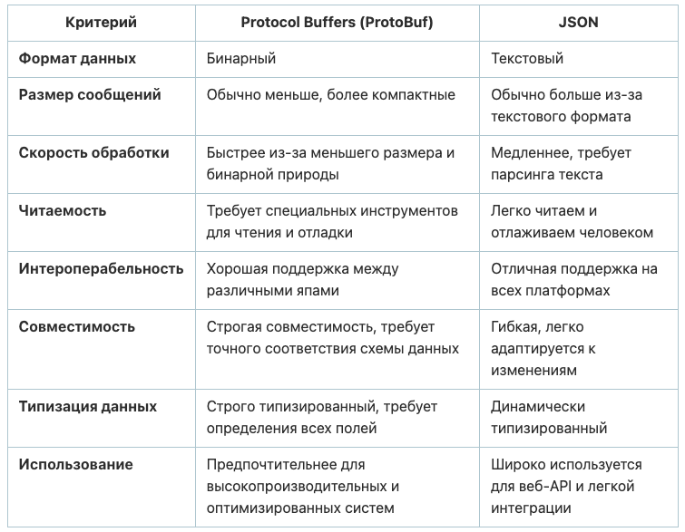

# Конспект по gRPC

### Предварительные настройки

- [Protocol Buffer Compiler Installation](https://grpc.io/docs/protoc-installation/)
- [Go plugins](https://grpc.io/docs/languages/go/quickstart/)

### Что такое RPC?

[RPC](https://ru.wikipedia.org/wiki/Удалённый_вызов_процедур) (Remote Procedure Calls) - система удаленного вызова
процедур. Позволяет программам вызывать функции и процедуры удаленно таким образом,
как‑будто они представлены локально.

- Представляет собой технологию межпроцессного
  взаимодействия ([IPC](https://ru.wikipedia.org/wiki/Межпроцессное_взаимодействие))
- Альтернатива REST
- Работает на HTTP/1.1

### Что такое gRPC?

[gRPC](https://grpc.io/) - фреймворк с открытым исходным кодом, реализующий традиционный RPC
с несколькими оптимизациями, такими как:

- HTTP/2 для передачи данных в двоичном формате
- [Protocol Buffers](https://protobuf.dev/) - определяет формат сообщений для обмена и интерфейс сервиса

### Сильные стороны gRPC

- Высокая скорость работы благодаря двоичному формату данных
- Быстрое создание gRPC клиентов
- Работает на разных языках и платформах
- Может использоваться для потоковых сервисов (REST не умеет в потоковую передачу!)
- Клиент и сервер gRPC могут быть реализованы на разных ЯП

### Шаги создания сервера и клиента gRPC

1. Создание файла языка определения интерфейса ([IDL](https://ru.wikipedia.org/wiki/Язык_описания_интерфейсов))
2. Разработка сервера gRPC
3. Разработка клиента gRPC, который может взаимодействовать с сервером gRPC

### Буферы протокола

Буфер протокола (protobuf) - метод сериализации структурированных данных.

- Protobuf является двоичным протоколом
- По умолчанию его пропускная способность намного выше, чем у текстовых
  протоколов, таких как JSON и XML
- Имеет собственные типы данных которые преобразуются в поддерживаемые типы
  данных используемого языка программирования

### Сравнение Protocol Buffers и JSON

# Функционал сервера

- Возвращает клиенту свою дату и время
- Возвращает клиенту случайно сгенерированные целые числа
- Возвращает клиенту случайно сгенерированный пароль заданной длины

# Дополнительные ресурсы

- [В чем разница между gRPC и REST?](https://aws.amazon.com/ru/compare/the-difference-between-grpc-and-rest/)
- [В чем разница HTTP/1.1 и HTTP/2?](https://www.digitalocean.com/community/tutorials/http-1-1-vs-http-2-what-s-the-difference)
- [HTTP 1, 2 и 3 — просто](https://habr.com/ru/articles/739166/)